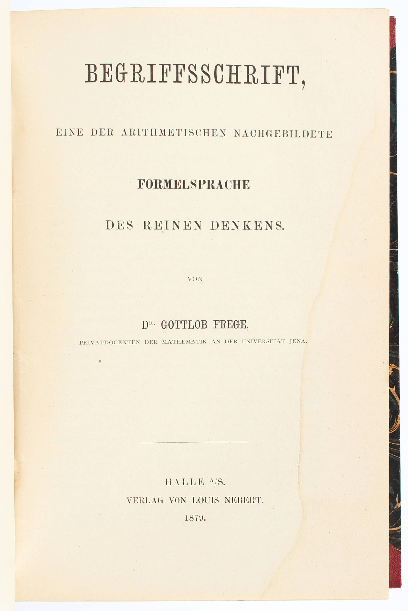

# 弗雷格的“思维公式语言”

在弗雷格之前，逻辑学研究的对象主要是以亚里士多德三段论为代表的传统形式逻辑。这种逻辑以"整体命题"（Propositions）作为最小分析单位，只能处理“所有 A 都是 B”、“有些 A 是 B”这类结构相对简单的推理，对涉及多重关系、量化结构或数学表达的复杂陈述几乎无能为力。

1879 年，德国哲学家、数学家戈特洛布·弗雷格（Gottlob Frege）发表了划时代的著作《概念文字》（德语：Begriffsschrift）。在这部作品中，他提出了一种以形式化符号为基础的逻辑系统，开创了后来被称为“**一阶谓词逻辑**”（First-Order Predicate Logic）体系。

:::center
   
  图 1879 年版《概念文字》
:::

与亚里士多德的传统逻辑相比，弗雷格的逻辑体系主要体现在以下两个方面：

- 将命题内部结构展开，**一个命题不再是不可分割的整体，而是拆分为个体词（表示具体对象，如“苏格拉底”）和谓词（表示对象的性质或关系，如“是人“、“会死“）**。譬如，命题“苏格拉底是人”可符号化为 $Human(Socrates)$，其中 $Human(\cdot)$ 是谓词，$Socrates$ 是个体词。更复杂的命题如“苏格拉底爱柏拉图”可写作 $Loves(Socrates, Plato)$。

- 引入量词体系。**弗雷格使用了“全称量词” $∀$（对所有...）和“存在量词” $∃$（存在某个...）来表达命题的适用范围与对象依赖关系**。同时，他还引入了逻辑连接词，如“蕴含”符号 →（表示“如果...那么...”）。譬如，亚里士多德逻辑中的命题“所有人都会死”，可符号化为 $∀x (Human(x) → Mortal(x))$。

借助谓词、变量与量词的结合，弗雷格的谓词逻辑在表达能力上远远超越了传统逻辑，能够描述涉及关系、属性的复杂命题。相应地，逻辑推理不再仅在命题整体上进行，而是作用于由对象、谓词和量词所构成的形式结构之中。譬如，给定以下两个前提：
$$
∀x(Human(x)→Mortal(x)) 
$$

$$
Human(Socrates) 
$$

可以形式推导出：

$$
Mortal(Socrates) 
$$

弗雷格将这一体系称为“一种模仿算术的纯思维公式语言”，这在逻辑史上称得上是一次革命，它使得逻辑推理第一次具备了完整的句法结构与语义约束，并获得了与数学语言相当的精确性。后来的罗素、皮亚诺、希尔伯特等人沿此方向继续发展，最终形成了我们今天所熟知的现代数理逻辑。