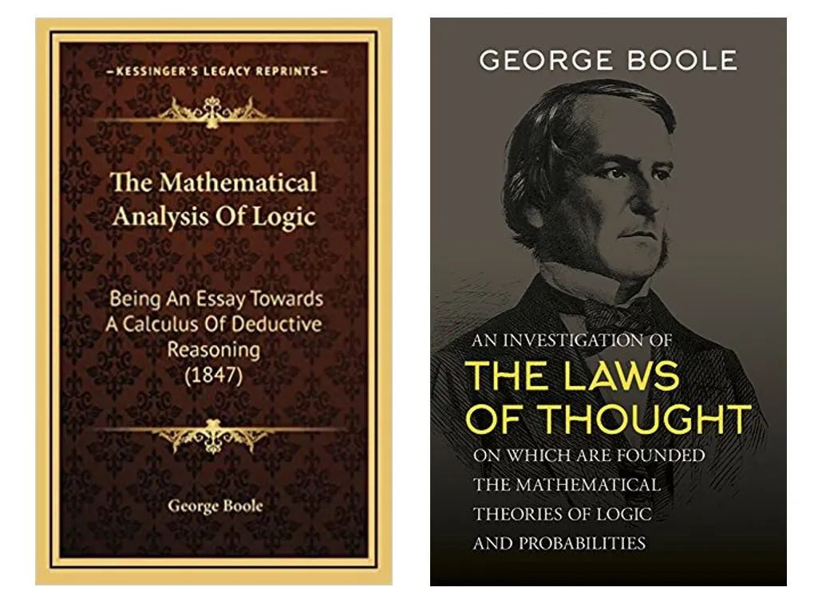

# 数理逻辑的复兴

1847年，布尔出版了他第一本86页的小书《逻辑的数学分析》（The Mathematical Analysis of Logic），建立了逻辑和代数的联系，并由此引进了符号逻辑代数。在引言中他写道：“我的目的是建立一种逻辑微积分，并且我可以宣称，它在公认的数学分析形式中占有一席之地，尽管它目前作为对象和工具都仍然是孤独的。”

1854年，布尔自行集资出版了另一本名著《思维规律的研究──逻辑与概率的数学理论基础》（An Investigation of the Laws of Thought, on Which Are Founded the Mathematical Theories of Logic and Probabilities）。他在序言中写道：
:::tip 《思维规律的研究》序言
本书要论述的，是探索心智推理的基本规律，用微积分的符号语言来进行表达，并在此基础上建立逻辑及其构建方法的科学……。
:::
该书进一步完善了第一本书的逻辑代数理论和方法，构建了一个完整的关于0和1的代数系统，并通过用基本逻辑的符号系统来描述多种数学和物理概念。书中，布尔试图解释他企图建立一个新的符号代数和逻辑系统的动机：“尽管不可能建立解决概率论问题的一种普适方法，让它不仅明确接纳科学的特殊数学基础而且接纳作为所有推理基础的普遍思维规律，但不管它们的本质是什么，至少能够让它们的形式是数学的。”

在这两部开山之作中，布尔实质上开辟了一个全新的数学分支，即包括“布尔代数”和“布尔逻辑”的现代数理逻辑学。

:::center
   
  图 布尔的两本逻辑代数学名著
:::

现代通用计算机在工程实现上普遍采用二值计算，即仅以 0 和 1 表示与处理信息。二值计算的数学基础可追溯至 1847 年英国数学家 乔治·布尔 提出的布尔代数（Boolean algebra）。

布尔以 0（假）和 1（真）表示逻辑状态，并定义了“与”（AND）、“或”（OR）、“非”（NOT）等基本运算，使逻辑推理能够通过代数符号（如 A ∧ B 表示“A 且 B”）进行计算。

这种形式化使得逻辑从语言与语义的层面脱离出来，进入了符号与运算的领域。思维过程被首次刻画为一种可计算的代数结构。推理不再依赖模糊的自然语言，而能在公式中精确地展开。布尔或许未曾预料到，他那套看似抽象的符号体系，后来成为现代计算机的基石。

直到 1938 年，一位叫克劳德.香农的麻省理工研究生在他的硕士论文中灵光一闪，将布尔代数嫁接到电路设计上。自此，工程师在设计电路时，能够以抽象的逻辑符号及其运算为中心进行推理建模。

这项具有巨大潜力技术的最终成就归功于美国数学家克劳德·香农（Claude Shannon，1916－2001）。1938年，香农在其硕士论文《继电器与开关电路的符号分析》中首次把布尔逻辑应用于电路分析与设计，建立了“逻辑、电路”的等价关系。。该论文被誉为20世纪最重要的硕士论文之一，它打通了两门原本毫不相关的学科，为电路的分析与设计奠定了严格的数学基础。

今天，所有计算机电路与逻辑门的运作，本质上都是布尔代数的物理化实现。布尔代数是将逻辑推理转化为可计算过程的第一步，也是“可计算智能”最早的数学雏形。

## 布尔家庭和家族

布尔夫妇育有五个女儿，五朵金花，流光溢彩。大女儿玛丽·爱伦嫁给数学家兼作家查理斯·辛顿，育有四个儿子。小儿子塞巴斯蒂安有三个子女，其中威廉·H·辛顿（William H. Hinton）就是大众熟知的“中国人民的好朋友”韩丁，他创作的关于中国土地改革的纪实文学作品《翻身──中国一个村庄的革命纪实》广为流传。韩丁的妹妹寒春（Joan Hinton）是参与过曼哈顿计划的少数女物理学家之一，晚年定居中国，去世时温家宝总理曾特别发唁电。

辛顿夫妇的长子乔治是采矿工程师，其子霍华德·辛顿（Howard Hinton）是著名昆虫学家，曾当选英国皇家学会院士。霍华德的儿子杰弗瑞·辛顿（Geoffrey Hinton）是人工智能领域的领军人物，被誉为“深度学习之父”，因发明神经网络反向传播算法而闻名，荣获图灵奖及诺贝尔物理学奖。

布尔最小的女儿艾捷尔是畅销小说《牛虻》的作者，该书西方不亮东方亮，是苏联和中国几代人的爱情加革命励志畅销书。

谁能想到，这一家子居然把中国、苏联、革命、逻辑、神经网络这些八竿子打不着的事儿，牵扯到一起。