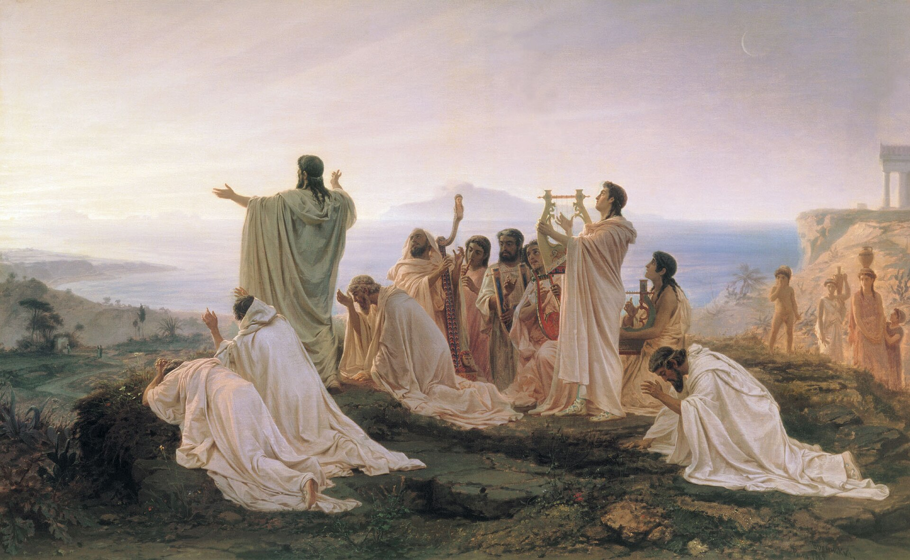
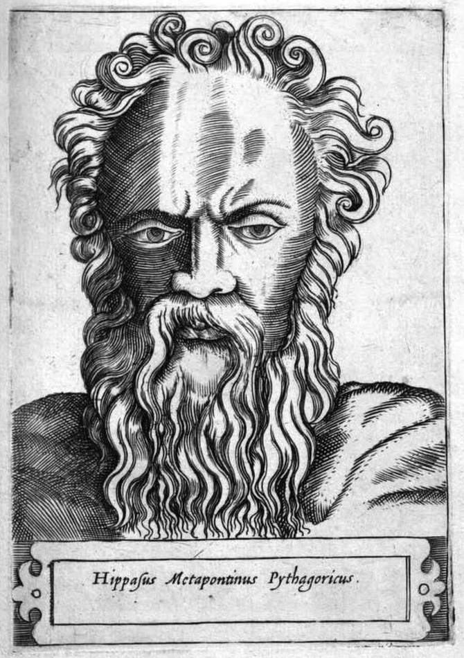

# 万物皆数

公元前 6 世纪，古希腊有一位著名的数学家、哲学家 —— 毕达哥拉斯（希腊语：Πυθαγόρας，前570年—前495年），被尊为“数学”的创始人。由他建立的毕达哥拉斯学派影响了整个古希腊的哲学发展，还被视为现代数学的开端。

:::center
   
  图 《毕达哥拉斯信徒向初升太阳致敬》早期的毕达哥拉斯学派类似于宗教团体，其信奉的哲学与科学基础不容侵犯
:::

毕达哥拉斯学派是古希腊早期重要的哲学学派之一。据说，这个学派有两句著名格言：“什么是智慧？只有数目。”“什么最美好？只有和谐。”在他们看来，数是宇宙最根本的规律。无论是琴弦振动形成的音程，还是天体运行呈现的秩序，都可以归结为整数及其比例关系。世界万物之所以和谐有序，正是因为其背后存在着数的规律。上述思想可以用一句话概括，即“万物皆数！”

毕达哥拉斯学派在哲学、音乐和数学上都有重要贡献。在数学领域，学派最著名的成就是对“勾股定理”[^1]的证明。事实上，早在毕达哥拉斯之前一千多年，古巴比伦、古埃及和古中国等文明就已经发现了直角三角形边长之间的特殊规律，并积累了大量实例。但这些古文明的认识大多停留在“勾三股四弦五”之类的经验总结层面。毕达哥拉斯学派的重要突破，在于首次运用**演绎推理（Deductive Reasoning）**，对这一规律进行了系统证明，将其提升为具有普遍意义的几何定理：直角三角形两条直角边平方和等于斜边的平方，即：
:::center
$x^2+x^2=y^2$
:::

遗憾的是，毕达哥斯拉学派的原始证明早已失传，今人已无法得见其具体内容。现存最早的严谨证明见于《几何原本》中[^2]。古希腊学者普罗克洛斯（Proclus, 公元 410–485）为《几何原本》作注解时，将最早的证明归功于毕达哥拉斯，后世因此将其称为“毕达哥拉斯定理”。

## 违背常识的 $\sqrt{2}$

前面提到，毕达哥拉斯学派信奉“万物皆数”，认为世界上一切和谐关系都可以用整数及其比例来表达。然而，在研究勾股定理所揭示的边长关系时，学派发现某些直角三角形的边长无法表示为整数之比。这一发现直接冲击了“万物皆数”的信念，并最终引发了数学史上的第一次危机。

据说，毕达哥拉斯的学生希帕索斯（Hippasus）在研究边长为 1 的正方形时发现，其对角线长度无法写成两个整数之比。

假设有个等腰直角三角形，两个直角边为 $x$，斜边为 $y$，根据毕达格拉斯定理 $x^2+x^2=y^2$。我们把这个几何问题转化为代数问题，就变为寻找自然数 x 和 y，使得等式 $2\times x^2=y^2$ 成立。也就是问：是否存在一个分数 $\frac{y}{x}$，其平方等于 2 ？若存在，则意味着 $\frac{y}{x} = \sqrt{2}$ 就是一个有理数。

表 4 以内 x 与 y 的所有可能性
|$x$| $y$ | $2\times x^2$|$y^2$|
|:--|:--|:--|:--|
|1|1|2|1|

在上面所有的情况里，显然没有满足 $2\times x^2$ = $y^2$ 的整数对。即便我们将搜索范围扩大至 1,000、10,000，乃至 100 万，所验证的也不过是无穷集合中的有限范围。由于整数对的组合是无穷无尽的，我们无法通过逐一枚举来完成证明，也无法断言在尚未触及的范围内必然无解。

面对这类涉及无穷的数学问题，依赖经验枚举和算术计算的方法失效了。数学开始需要一种全新的证明方式

## 从算术到演绎推理

希帕索斯对于“根号2不是有理数”，证明方法大致过程是这样的：

:::tip 用反证法推理出矛盾的结论

假设 $\sqrt{2}$ 是有理数，则存在互质自然数 $p$ 和 $q$，使得：

$$
\sqrt{2} = \frac{p}{q}.
$$

两边平方：

$$
2 = \frac{p^2}{q^2} \quad \Rightarrow \quad p^2 = 2 q^2.
$$

由于只有偶数的平方是偶数，因此 $p$ 必为偶数，设 $p = 2s$，代入上式：

$$
p^2 = 4s^2 = 2 q^2 \quad \Rightarrow \quad q^2 = 2 s^2.
$$

所以 $q$ 也为偶数。

由于 $p$ 和 $q$ 皆为偶数，不互质。与前述互质的假设矛盾，因此原假设错误，$\sqrt{2}$ 不是有理数。

:::

上述方法是数学史上反证法最著名的应用之一，其意义不可小觑。这一证明首次借助纯粹的逻辑推理研究数学自身的性质与结构，使其超越了仅作为算术工具的局限，并开始在实践之外获得自我演进的动力。

无理数的发现，直接动摇了毕达哥拉斯学派“万物皆数”的信念，在他们看来，世界的一切规律都能够归结为整数及其比例关系，$\sqrt{2}$ 的出现却表明，存在某些量无法表示为任何整数之比。用今天的眼光来看，这一冲击不亚于有人告诉你“1+1 不再等于 2”。面对这一既无法否定、又难以纳入原有理论体系的事实，毕达哥拉斯学派一度将其视为不可公开的秘密。据传，希帕索斯因公开这一结论，遭到学派秘密处决，被扔入地中海淹死，学派声称这是触怒他们信仰的整数之神所受到的惩罚。

:::center
   
  图  《希帕索斯的雕版画》 可怜的希帕索斯，或许是历史上第一位为真理献身的人！
:::

可以想见，$\sqrt{2}$ 之后，必然会有$\sqrt{3}$、$\sqrt{5}$、$\sqrt{6}$ 越来越多的无理数被发现。为了逃避这场危机，希腊人从偏重算术逐渐转向偏重几何研究。在算术里，像 $\sqrt{2}$ 这样的数无法用整数比表示，但在几何中，它却可以被理解为正方形对角线与边长之间的关系。借助几何对象之间的逻辑关系，古希腊人得以通过演绎推理，对这些“不可通约”的量进行解释与处理。

从这个转变来看，古希腊数学逐渐从偏重实用“算术”走向更加抽象的理论研究。研究对象和方法的变化，引发了数学思想上的一次巨大革命：欧几里得的编著旷世奇书《几何原本》，开创了“公理—演绎系统”；阿基米德则运用无穷小概念和穷尽法推导并证明了一系列几何定理，为现代微积分和分析奠定了启蒙基础。就连柏拉图和亚里士多德，也深受几何思想影响，经常借助几何学阐释哲学理论。

至于无理数，虽然少数数学家尝试为它建立理论基础，但发展缓慢。直到 19 世纪下半叶，德国数学家理查德·戴德金（Richard Dedekind）提出“戴德金分割法”（Dedekind cut），从有理数出发构造出完整的实数体系，人们才逐渐接受无理数作为一种特殊数字。持续了 2000 多年的第一次数学危机就此落下帷幕。

[^1]: 据文献记载，公元前 11 世纪左右，中国古代已有类似“勾三股四弦五”的经验性认识，这也是人类最早将数与形结合的实例之一。
[^2]: 见《几何原本》第一册的第 47 个命题。