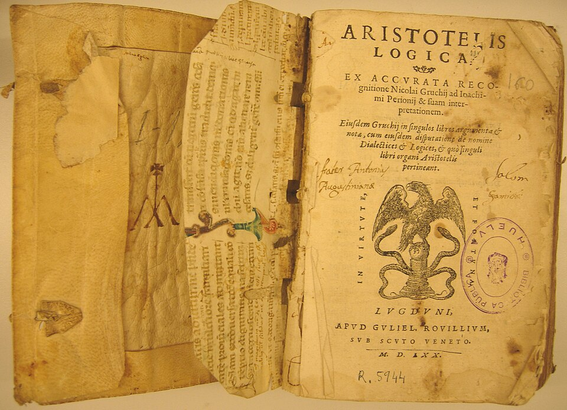

# 思维的形式化

仅用“数”来表示事物，还不足以形成智能。智能不仅在于“表示”，更在于“推理”—— 即能够从已知出发，得出未知的结论。推理之所以可靠，必须依循一套可重复、可验证的规则体系，这套体系正是逻辑。

## 亚里士多德的逻辑

现代科学中所说的逻辑学，起源可追溯至亚里士多德（Aristotle，公元前384–前322）。作为古希腊哲学家，他首次系统建立了逻辑学说，其著作合集《工具论》（Organon）奠定了西方逻辑学的基础，持续影响了西方思想两千余年（直到近代数理逻辑兴起）。

:::center
   
  图 文艺复兴时期出版的《工具论》拉丁文合订本，封面印有“ARISTOTELIS LOGICA”（亚里士多德的逻辑）。
:::

亚里士多德在他的《工具论》中提出了传统逻辑学中最基本的“三段论”（Syllogism）推理形式。关于三段论推理，笔者举一个几乎在所有逻辑书上都有引用的例子：

- 所有人都会死； (大前提，确定普适原则)
- 苏格拉底是人；（小前提，确定个体实例）
- 苏格拉底会死。（结论，得到必然结果）

在这个例子里，每句话都可以看作一个“命题”（proposition）。最后一句是结论，前两句是支撑结论的前提，分别叫大前提和小前提。三段论就是一种以**一个一般性的原则（大前提）以及一个附属于一般性的原则的特殊化陈述（小前提）**，由此引申出一个**符合一般性原则的特殊化陈述（结论）的推理过程**。这种从普遍前提推导出具体结论的方式，属于典型的演绎推理。

| 类型 | 名称 | 逻辑形式 | 示例 |
|------|------|----------|------|
| A | 全称肯定 | 所有 S 都是 P | 所有人都是会死的 |
| E | 全称否定 | 所有 S 都不是 P | 所有鸟都不是哺乳动物 |
| I | 特称肯定 | 有些 S 是 P | 有些人是学生 |
| O | 特称否定 | 有些 S 不是 P | 有些人不是学生 |

三段论推理的结论必然性取决于推理形式是否有效、以及前提是否正确。如果前提错误（比如大前提或小前提的类别不匹配）或推理形式不对，结论虽然形式上是“有效三段论”，但内容上可能不成立。举一个推理形式正确，但归类错误的例子：

- 鱼用腮呼吸
- 鲸鱼是鱼
- 鲸鱼用腮呼吸

鲸鱼在水中生活，外表又长得像鱼，之前人们认识不足，将“鲸”归类为鱼，甚至体现在对它的命名上。现代分类学已明确鲸鱼是哺乳动物，小前提 “鲸鱼是鱼” 不符合生物学事实，三段论的推理形式本身是有效的（如果前提为真，结论必真），但因为小前提“鲸鱼是鱼”这个分类是错误的（前提为假），所以得出了一个符合逻辑但不符合事实的结论。

逻辑学提供的是从前提通往结论的可靠路径，保证推理过程的严谨性，但路径的起点（前提）是否真实，需要依靠其他学科和经验来验证。

## 以“公理化方法”建立真理系统

::: 徐光启评价几何原本

:::
稍微晚一点的

在欧几里得之前，古埃及人通过长期实践掌握了丈量土地的方法，中国人用“圭表”来推算太阳高度和方向，但这些几何知识都是零散的、经验性的。只有欧几里得，他从少数几个不证自明的公理出发，以严密的逻辑推理构建出一整座自洽而完备的几何学大厦。

欧几里得的整个几何体系建立这 5 条公理之上：

- 过任意两点，能作且仅能作一条直线（直线公理）。
- 线段可以无限延长（延长公理）。
- 以任意点为圆心、任意长为半径，可作圆（圆公理）。
- 所有直角相等（角公理）。
- 若两条直线被第三条直线所截，使同侧内角和小于两个直角，则这两条直线在该侧相交（平行公理）。

这便是“公理化方法”，这是人类思想史上的一次巨大飞跃。它告诉我们，**只要确立不证自明的起点，就可以通过严密的逻辑推演建立起宏大的真理系统**。这种思想影响的不仅是数学，是整个西方科学的根基。古希腊人的逻辑、公理化思想，经过阿拉伯人的中转，传给了古罗马人，在文艺复兴之后被系统继承与发展，创造了现代科学体系。