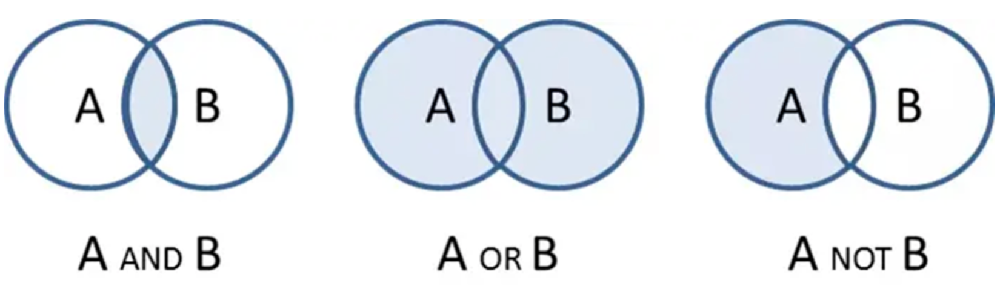

# 1.5 数理逻辑的复兴

乔治·布尔出生于英格兰的林肯（Lincoln）镇，是一位鞋匠的儿子。老布尔是位聪明的匠人，但相比于专心磨练手艺改善家计，反倒热衷科学，尤其喜欢研究和制作光学仪器。受父亲影响，小布尔打小就热衷学习各种知识。布尔十来岁时，自学了拉丁语、希腊语，这在后来派上了用场。

16 岁那年，老布尔的作坊破产，布尔不得不辍学回家，后来凭借语言能力找到一份助教工作，养家之余开始认真钻研数学。据布尔解释，研究数学的原因是缺钱买书，数学书看的时间可以更长一些。因为星期天做礼拜时还在看数学书，被认为对神不敬，之后丢掉了这份工作。19 岁那年，布尔开办了一所小型寄宿学校，此后一边教书，一边继续钻研数学，陆续在《剑桥数学期刊》（Cambridge Mathematical Journal）发表论文，逐渐受到英国数学界关注。但因为没有学历，布尔没有进入大学任职的机会。好在天无绝人之路英国政府在爱尔兰新建三所皇后学院，布尔获得了科克皇后学院（Queen's College, Cork，今科克大学 University College Cork）的数学教授职位。此后，他一直在这里任教，直至去世。

布尔一生发表了约 50 篇论文和多部著作，研究涉及微分方程、数学分析和有限差分等领域。不过，他影响最深远的成就还是在逻辑领域。1847 年，他出版《逻辑的数学分析》，首次系统地将代数方法引入逻辑研究，把传统逻辑中的概念、类别和推理关系转化为数学符号。1854 年，他又出版《思维规律的研究》，进一步完善了逻辑代数体系，使原本主要依靠自然语言表达的逻辑推理，可以写成公式，按照明确的规则进行运算。

:::tip 《思维规律的研究》序言
本书要论述的，是探索心智推理的基本规律，用微积分的符号语言来进行表达，并在此基础上建立逻辑及其构建方法的科学……。
:::

:::center
   
  图 布尔的两本逻辑代数学名著
:::

布尔的这两部开山之作，将逻辑引入符号与代数运算的领域，实质上开辟了一个全新的数学分支，即包括“布尔代数”和“布尔逻辑”的现代数理逻辑学。

## 逻辑与代数

今天看来，代数无非是使用 $x$、$y$、$z$ 等符号进行运算，但在 19 世纪的英国，却没人能解释清楚：**代数究竟研究什么？**如果代数只是算术的推广，那么其中的符号最终都应该代表某种“数”。

1830 年，英国数学家乔治·皮科克（George Peacock，1791—1858）出版《代数论》（Treatise on Algebra），他将代数分为“算术代数”和“符号代数”：前者以通常的数为对象，运算受具体数值意义限制；后者把字母视为符号，按照规定的法则进行运算。为了说明算术中的运算法则为什么可以推广到符号运算，皮科克提出“等价形式恒存原理”：凡在算术代数中普遍成立的运算形式，也可以扩展到符号代数。虽然这一理论今天看来还不够严格，但推动代数逐渐摆脱对具体数字的依赖，开始转向对符号及其运算规则本身的研究。

皮科克的思想很快影响了一批英国数学家，其中就包括奥古斯都·德·摩根（Augustus De Morgan，1806—1871）。德·摩根把符号及其运算规律的研究带进了逻辑。1847 年，他出版《形式逻辑》（Formal Logic），重新考察亚里士多德以来的三段论，并尝试用更精确的形式描述推理过程。

传统亚里士多德三段论能够处理类别之间的包含和排斥关系，但它对数量的表达十分有限，也难以把推理写成可计算的式子。布尔的做法是：把概念看作集合，把推理改写为集合上的代数运算。

:::center
   
  图 布尔逻辑的三种关系
:::

以经典三段论为例。设全体人类组成集合 $R$，全体会死之物组成集合 $D$，苏格拉底为单元素集合 $S$（里面只有他一人）。已知：

$$
S \times R = S \quad \text{（苏格拉底是人）}
$$

$$
R \times D = R \quad \text{（人都会死）}
$$

要证明的是 $S \times D = S$（苏格拉底会死）。推导如下：

$$
\begin{aligned}
S \times D
&= (S \times R) \times D \\
&= S \times (R \times D) \\
&= S \times R \\
&= S.
\end{aligned}
$$

第一步用的是 $S \times R = S$，把左边的 $S$ 换成 $S \times R$；第二步用结合律；第三步代入 $R \times D = R$；最后再一次用到 $S \times R = S$。自然语言里的三段论，就这样变成一串可以按规则算下去的等式。

不过，布尔的思想过于超前。之后几十年，虽有罗素、怀特海这样的学者继续研究和推广布尔逻辑，但在大多数人眼里，布尔逻辑只不过是一种没有实际用途的智力游戏。

直到 1938 年，年仅 21 岁的香农发表硕士论文《继电器与开关电路的符号分析》，这篇论文被誉为 20 世纪最重要的论文之一（另一篇是图灵的《论可计算数》，笔者将在第二章展开介绍）。香农**开创性地把一个世纪之前出现的布尔代数和电路中的继电器这两个看似风马牛不相及的事物结合在一起，用继电器的“通”与“断”来表示布尔代数中的“真”与“假”，使电路中的两种状态不再只是电气状态，可以用来表示信息、执行逻辑运算**，由此开辟了逻辑电路和二进制计算的天地。

## 弗雷格的“思维公式语言”

在弗雷格之前，逻辑学研究的对象主要是以亚里士多德三段论为代表的传统形式逻辑。这种逻辑以"整体命题"（Propositions）作为最小分析单位，只能处理“所有 A 都是 B”、“有些 A 是 B”这类结构相对简单的推理，对涉及多重关系、量化结构或数学表达的复杂陈述几乎无能为力。

1879 年，德国哲学家、数学家戈特洛布·弗雷格（Gottlob Frege）发表了划时代的著作《概念文字》（德语：Begriffsschrift）。在这部作品中，他提出了一种以形式化符号为基础的逻辑系统，开创了后来被称为“**一阶谓词逻辑**”（First-Order Predicate Logic）体系。

:::center
   
  图 1879 年版《概念文字》
:::

与亚里士多德的传统逻辑相比，弗雷格的逻辑体系主要体现在以下两个方面：

- 将命题内部结构展开，**一个命题不再是不可分割的整体，而是拆分为个体词（表示具体对象，如“苏格拉底”）和谓词（表示对象的性质或关系，如“是人”、“会死”）**。譬如，命题“苏格拉底是人”可符号化为 $\mathrm{Human}(\mathrm{Socrates})$，其中 $\mathrm{Human}(\cdot)$ 是谓词，$\mathrm{Socrates}$ 是个体词。更复杂的命题如“苏格拉底爱柏拉图”可写作 $\mathrm{Loves}(\mathrm{Socrates},\mathrm{Plato})$。

- 引入量词体系。**弗雷格使用了全称量词 $\forall$（对所有……）和存在量词 $\exists$（存在某个……）来表达命题的适用范围与对象依赖关系**。同时，他还引入了逻辑连接词，如蕴含符号 $\rightarrow$（表示“如果……那么……”）。譬如，亚里士多德逻辑中的命题“所有人都会死”，可符号化为 $\forall x\,(\mathrm{Human}(x) \rightarrow \mathrm{Mortal}(x))$。

借助谓词、变量与量词的结合，弗雷格的谓词逻辑在表达能力上远远超越了传统逻辑，能够描述涉及关系、属性的复杂命题。相应地，逻辑推理不再仅在命题整体上进行，而是作用于由对象、谓词和量词所构成的形式结构之中。譬如，给定以下两个前提：

$$
\forall x\,(\mathrm{Human}(x) \rightarrow \mathrm{Mortal}(x))
$$

$$
\mathrm{Human}(\mathrm{Socrates})
$$

可以形式推导出：

$$
\mathrm{Mortal}(\mathrm{Socrates})
$$

弗雷格将这一体系称为“一种模仿算术的纯思维公式语言”，这在逻辑史上称得上是一次革命，它使得逻辑推理第一次具备了完整的句法结构与语义约束，并获得了与数学语言相当的精确性。后来的罗素、皮亚诺、希尔伯特等人沿此方向继续发展，最终形成了我们今天所熟知的现代数理逻辑。
