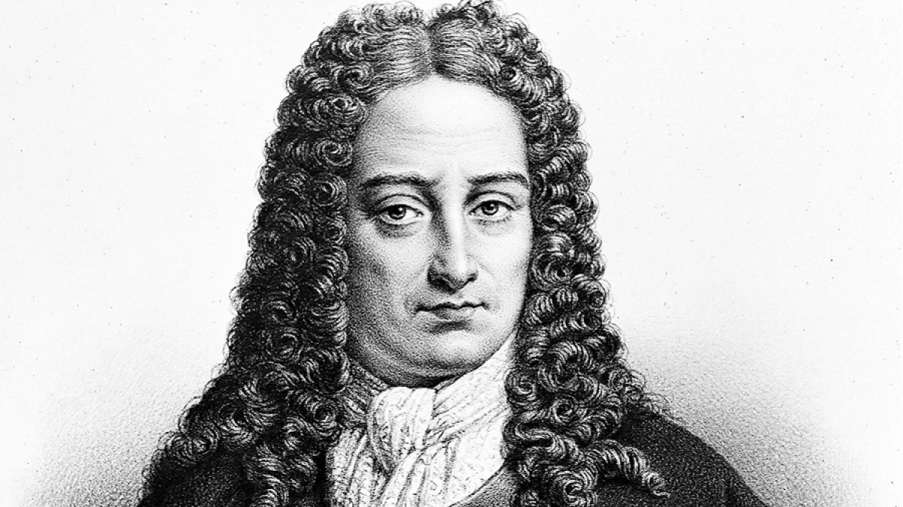

# 莱布尼茨之梦

莱布尼茨有多牛逼，笔者几句话说不清楚。反正牛顿晚年的主要精力，就是喷莱布尼茨。

:::center
   
  图 “17 世纪的亚里士多德”、人类最后的“全才”亚里士多德画像
:::

鉴于牛顿的地位和他狂妄自大的性格，读者们应该理解：若非出于内心忌惮，他肯定会躲在伦敦某个角落琢磨炼金术，根本不会冒着身败名裂的风险，用假名去评判对手。即便与伟大的胡克^1 较量，他都觉得是在侮辱自己的智商，只是偶尔阴阳怪气地恶心几句“我的研究是站在巨人肩膀上”（standing on the shoulders of **Giants**，胡克是个驼背的矮子，牛顿刻意用“Giants”来侮辱他）

鲜为人知的是，莱布尼茨在符号逻辑领域的开创性贡献，其意义丝毫不亚于他在微积分领域的成就。

1666 年，时年 20 岁的莱布尼茨出版了《论组合的艺术》（De Arte Combinatoria）。在书中，他提出：人类的思想可以分解为有限的基本概念，复杂的思想则是这些基本概念按照一定规则组合的结果。正如单词由字母组成、句子由单词组成一样，如果能够用统一的符号表示这些基本概念，并建立严格的组合规则，那么推理就可以像计算一样按照规则进行。这个思想，就是后来逻辑演算、以及将逻辑与数学统一为“普遍数学”设想的早期萌芽。

:::tip 莱布尼茨之梦

我们每天看到的世界，是通过具体画的、非结构化的形式（如视觉、声音、文字）呈现的，这些具体却散漫粗疏的内容是否可以用符号来精确定义？人类理解世界的过程，是否可以在这个基础上精确描述和计算？

:::

## 普遍文字

将这种 “公理化 + 逻辑推演” 的模式推向极致。他提出，首先要建立一份 **“思想字母表”，即把所有人类复杂的思想，还原为少数几个不可再分的、如同 “原子” 一样的基本概念；然后，为这些基本概念创造一套“普遍文字”（Characteristica Universalis），这是一套完全人工设计的、无歧义的通用符号系统 **，给每一个 “思想字母” 配上一个独一无二的符号。

一旦这个系统建立，所有的思考就将如同进行数学演算一般：复杂的思想命题，可以被还原为这些基本符号的组合。我们不再需要依赖充满歧义的自然语言进行辩论或推理，只需像解数学题一样，对这些符号进行机械的组合与演算。一旦出现分歧，问题不再是 “你我的理解不同”，而是 “我们可以坐下来，拿出纸笔，一起算一算”。

因为没有符号逻辑的支撑，《几何原本》中很多概念不得不使用自然语言、图形这类感性的认知来定义，或者索性就不定义了。譬如，欧几里得第一公设：

:::tip 直线公设

过任意两点可以作一条直线

:::
笔者相信只要受过基础教育的人都能理解这条公设的含义。但是，如果你、我所接受的教育背景、语言语境不同，欧几里得有办法能保证你看到这句话，和我看到这句话的理解是一致的吗？并没有。什么是点、线、面？欧几里得虽然给出了定义，可定义本身就含糊不清。譬如，给点的定义是“没有部分的”，什么是没有部分的？给直线的定义是“在其所有点上都是平直的线”，什么又是“平直”？

如果我们向其他人介绍直线公设，就必须先解释什么是“点”，什么是“直线”，什么是“任意”。在解释这些概念时，又难免引入新的、尚未定义的概念。由此可见，仅依靠自然语言难以做到绝对严谨。这时，符号化表达的优势就显现出来了。

如果用逻辑符号来表示，“直线公设”可以写成：

$$
\forall A \forall B \; (A \ne B \rightarrow \exists !\, l \; (A \in l \land B \in l))
$$

在符号$\forall$、$\exists$、$\in$ 被精确定义的前提下，这个式子的意义便完全确定，再无自然语言中的含糊之处。

**这种由一组符号及其组合规则构成、只关注符号结构而不依赖自然语言语境的语言，就叫形式语言。把自然语言中的概念、命题或推理用这种符号语言表达出来的过程，就叫形式化**。形式语言不仅是数学逻辑的重要工具，更是在计算机科学随处可见，无论是计算机编程语言、正则、还是各种算法模型，本质上都可以看作某种形式语言，或者是对形式语言的操作和处理。

## 思维演算

莱布尼茨的思想过于超前，提出的逻辑演算和普遍语言的宏伟构想，终其一生未能实现。但他的想法启发了后人，直接影响了布尔、弗雷格、罗素等人的工作，经过后人两百多年的积累与发展，数理逻辑的基础终于得以奠定。

[^1]: 罗伯特·胡克（Robert Hooke）是17世纪英国最杰出的科学家之一，英文“cell“(细胞) 就是他命名的。由于他与牛顿在学术上存在冲突，胡克去世后，牛顿清理了皇家学会中所有与胡克有关的资料，以至于没有留下任何他的肖像。