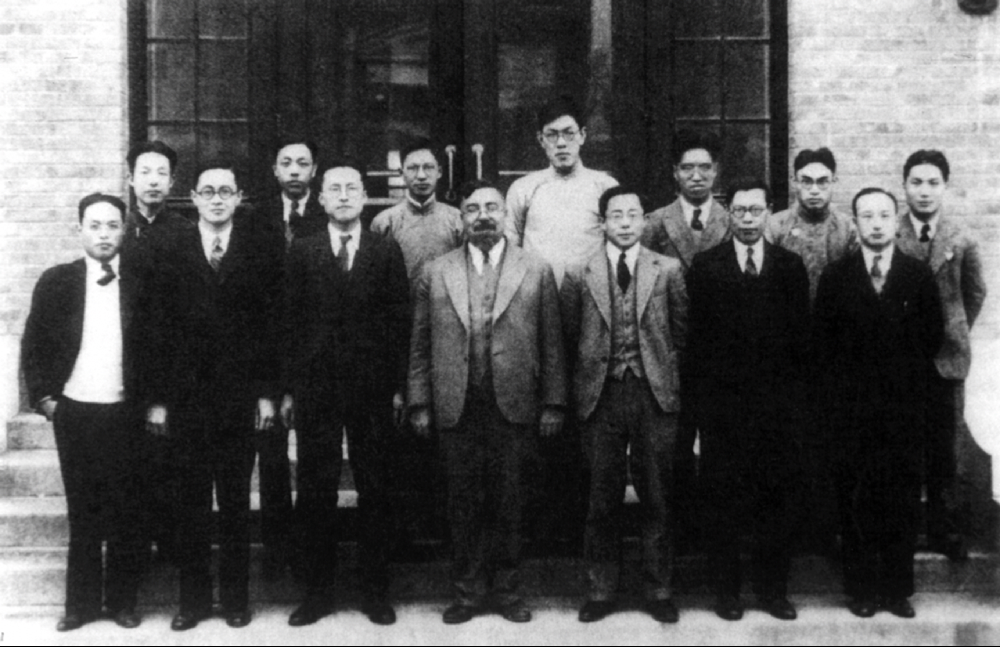

# 赛博传奇

1894年11月26日，诺伯特·维纳（Norbert Wiener，1894～1964）出生于美国密苏里州的一个犹太人家庭。说到犹太人，争议不少，但有一点毋庸置疑，这个族群孕育了大量享誉世界的天才，如爱因斯坦、哥德尔、冯·诺依曼、奥本海默等等。

维纳的父亲利奥·维纳在语言学习方面堪称超人。作为出生在波兰的俄裔犹太人，他从小就在多语环境中掌握了德语、波兰语、希伯来语、俄语及比亚韦斯托克方言。后来在欧洲漂泊期间，又学会了英语、西班牙语、拉丁语、意大利语、荷兰语、法语、克罗地亚语和丹麦语。移民美国后，他能够流利使用的语言多达四十余种，也凭借这一能力成为哈佛大学的语言学教授。

维纳是名副其实的神童。3岁时，他便能独立阅读生物学和天文学书籍；到7岁时，其学识甚至超过了父亲的掌握范围。从达尔文的进化论、金斯利的《自然史》到夏尔科、雅内的精神病学著作，从儒勒·凡尔纳的科学幻想小说到18、19世纪的文学名著等，几乎无所不读。

维纳的父亲可能不想浪费儿子的天赋，也可能希望弥补自己未受良好教育的遗憾。从维纳很小的时候起，老维纳几乎“发狂”般地力图将他培养成天才神童。老维纳的教育手段“极为挑剔和苛刻”，主要表现为语言攻击和精神折磨：每天要求年仅六岁的维纳完成海量课业，并亲自检查，只要稍有差错，便会用英语、德语及他熟练掌握的四十多种语言疯狂辱骂挖苦。维纳成年后曾著书回忆这段经历：
:::tip 《昔日神童》(1953) 节选

对我而言代数并不难，不过父亲教授代数的方式远远谈不上平和。每次一犯错就会被立刻纠正。他会用轻松的对话式语调开始讨论，直到我犯了第一个数学错误。然后温和慈爱的父亲突然变成了报血仇者。

:::

童年的经历在维纳心理上留下了难以愈合的阴影，他自幼患躁郁型抑郁症，并终生饱受困扰。成年后，他曾多次向家人和麻省理工学院（MIT）的同事倾诉绝望，甚至表达过自杀念头。无论面对政府、军方、媒体还是学术同行，他总带着难以掩饰的不安全感，还有其他性格上的缺陷都可追溯至这些早期创伤。此外，长期用眼过度和精神压力导致他自小深度近视，晚年甚至需要扶墙行走。维纳将这些痛苦的童年记忆，详尽记录在自传《昔日神童：我的童年和青年时期》（Ex-Prodigy: My Childhood and Youth）中。

到了小维纳 9 岁时，老爹的教育实验终于不得不被动停止。原因是老维纳接到了“大活”，就是开头提到的翻译整套托尔斯泰的作品。9岁时，维纳直接进入高中；12岁进入大学；15岁获得数学学士学位。随后，他在哈佛大学攻读动物学研究生，但因眼疾影响实验操作而不得不放弃。此后，他转至康奈尔大学研修哲学，次年又回到哈佛专攻数理逻辑，最终以哈佛大学哲学博士学位毕业。

结束哈佛学业后，18岁的维纳获得旅行奖学金，先后前往英国剑桥大学师从哲学家伯特兰·罗素（Bertrand Russell）学习数理逻辑，又到德国哥廷根大学跟随大数学家大卫·希尔伯特（David Hilbert）研习数学分析与数学物理。正是剑桥和哥廷根的经历，使神童维纳成长为青年数学家。回首往事，他常怀感激之情，尤其怀念罗素以及剑桥与哥廷根的求学岁月。

维纳在哥廷根只待了一学期，1914年6月28日，“萨拉热窝事件”[^1]爆发，德国进入战争状态，维纳不得不返回美国。

学成归来的维纳意气风发，决定用在欧洲学到的本事在学术领域大展拳脚。虽然年仅 20 岁，但维纳打算先申请哈佛大学终身教授职位，结果事实证明，主观能动性无法决定客观事实，此时的哈佛大学盛行沙文孤立主义，并且也有强烈的排犹风气。维纳不仅未获终身教授提名，哈佛大学甚至不愿意安排一个普通教授的职位。

试图参军，但因视力不佳而被拒绝，随后的几年离，当过通用公司的工程师、记者

这位“昔日神童”在母校无处立足，，这所大学就是刚刚兴起的麻省理工（MIT）。

自 1919 年起，维纳在 MIT 扎根，正式开启了学术研究生涯 —— 更准确地说，他开启了学术研究的“外挂”。仅一年后，他将法国数学家 Fréchet 关于极限与微分的广义理论推广到矢量空间，并提出了一整套完整的公理体系。这项研究成果也被称为维纳空间理论，关于这套理论，我们只需要知道一点，七年后，冯诺依曼提出的希尔伯特空间理论，其算子公理化方法正是建立在维纳这套理论的基础上。这一成果在五年后再次升级，最终形成了著名的《量子力学的数学基础》。

1921 年，维纳马不停蹄的发表了一篇关于布朗运动的重要论文，使他成为首位从数学上严格而深入地研究随机布朗运动的学者。凭借这篇论文，维纳在数学界完成了个人命名的“帽子戏法”：数学文献中将定义在连续函数空间上、用于描述布朗运动的测度称为**维纳测度**，相应的随机过程称为**维纳过程**，在该测度下的积分称为**维纳积分**。后来的日本数学家伊藤清（Kiyosi Itô）又在此基础上创立了随机积分理论。

有一次，维纳带了一位留学生。当得知对方来自中国时，他立刻上前用普通话交流。然而，对方的普通话并不流利，维纳一问才知道，对方说的是广东话。出乎意料的是，维纳竟然也能用广东话与他交谈。结合时间和背景，这位留学生很可能就是来自广东新会的李郁荣博士。李郁荣深受维纳的赏识，两人在麻省理工的研究也配合的非常默契。1931 年，两人共同研究出了维纳滤波器，将无线电信号进行过滤和放大，来改善电子录音的质量。自此，收音机、电话、电视等设备的音频质量得到了质的飞跃。若干年之后，李郁荣带过的一位印度裔学生，将这种技术应用在了音响上，并且创立了自己的品牌。这个学生的名字叫阿玛·戈帕尔·博赛（Amar Gopal Bose），他创立的品牌就是如今耳熟能详的 BOSE。

尽管李郁荣取得了里程碑式的成就，但博士毕业后仍未能在美国找到合适的工作，当时的美国电子工程行业几乎完全对亚洲人关闭。于是，他在 20 世纪 30 年代初选择回国，赴清华大学任教。在他的积极推动下，时任清华校长梅贻琦向维纳发出了学术交流的邀请。维纳一直对东方文化怀有浓厚兴趣，他曾说：“我从未觉得欧洲文化优于伟大的亚洲文化。与源远流长的东方文明相比，欧洲文明不过是人类历史上的一段短暂插曲。”

在收到梅贻琦的邀请后，维纳欣然启程，远渡重洋来到中国。在清华期间，他与李郁荣、顾毓琇先生合作提出了离散计算机的设想。清华大学随即向麻省理工学院申请购买相关设备以开展实验，如果计划得以实施，当时中国在计算机研究上或许一度领先美国。可惜，这一计划最终因种种原因被当时 MIT 工程院院长范内瓦·布什（Vannevar Bush）否决。
:::center
   
  图 1936 年维纳与清华大学电机系人员合影：前排中间维纳，左二李郁荣，左三顾毓秀
:::

为了尽可能推动当时中国的科研事业，维纳还极力鼓动冯·诺依曼前往清华交流，然而动身之际，抗日战争全面爆发，全盘计划化为乌有，为了家人的安全，维纳也不得不返回美国。

1940年，基于在清华与李郁荣、顾毓琇的合作研究成果，维纳给范内瓦·布什写了一封长信，提出设计新型电子计算机的五项原则：

- 采用数字程序而非模拟程序 —— 使用离散数字信号处理计算，而非模拟电路。
- 使用电子元件而非机械部件 —— 利用电子管或其他电子元件进行高速运算。
- 采用二进制而非十进制 —— 用二进制表示数据和指令。
- 在机内存储数据和计算表格 —— 使计算机能够内部存储程序和数据。
- 集成设计原则 —— 整合数据、程序与计算机制，确保计算机作为整体协调运行。

熟悉计算机的读者可能能发现，这五项原则与现代计算机几乎如出一辙。布什不仅在 MIT 任职，还是美国总统罗斯福的科学顾问，统筹国家科研力量，他自然能理解维纳的想法，也能预见其对计算机发展的潜力。然而，布什“十动然拒”，没有提供相应经费，因为他认为如此庞大的计划不可能在二战结束前完成。战争时期科研资源有限，他必须优先支持那些能迅速产生军事价值的项目（比如搞原子弹）。事实证明，他判断错误：世界上第一台通用计算机 ENIAC 于 1942 年在宾夕法尼亚大学诞生。

如果布什当时采纳了维纳的建议，现代计算机之父恐怕就该姓“维”而不是“冯”了。冯诺依曼自己也曾描述，他设计的计算机实际上是“第一台将维纳提交给布什的五项原则整合为一的机器”。这也解释了为何有人认为，所谓“冯诺依曼架构”更准确的称呼应该是“维纳-冯诺依曼架构”。

维纳关于计算机的研究被搁置，很大一部分原因是此时的布什实在没工夫，他所负责的美国国防研究委员会正在紧锣密鼓为军方服务，研究火炮放空系统。

::: tip 维纳形容自己
他就是盗火给人类而牺牲了自己的普罗米修斯，把智能机器的 “自动智能” 新技术带给了人类，却担心人类屈从于机器、放弃选择和控制的权利，内心总是充满了一种即将来临的 “悲剧感”，“觉得自己是一个会给人类带来灾难的先知”。
:::

[^1]: 1914年6月28日，奥匈帝国皇位继承人弗朗茨·斐迪南与妻子在萨拉热窝乘车访问时，遭到极端组织成员的袭击，双双中枪身亡。这一刺杀案引发连锁反应，最终导致了第一次世界大战的爆发。