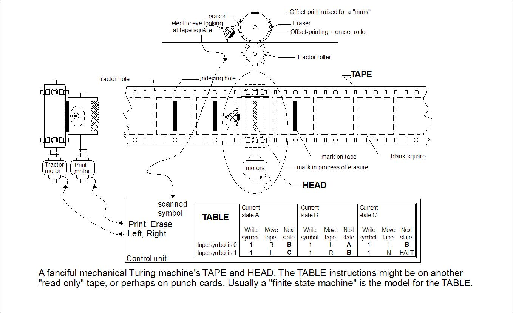
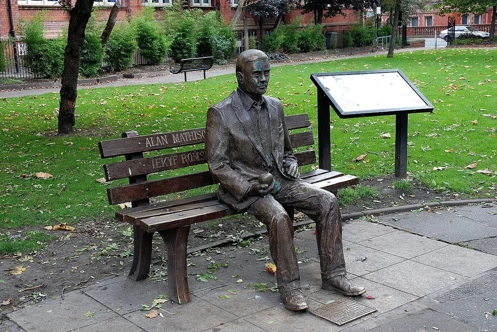

# 可计算性理论

可计算性理论的起源可以追溯到 20 世纪 30 年代。1900 年，著名的德国数学家大卫·希尔伯特（David Hilbert，1862年1月23日—1943年2月14日），在国际数学家大会上提出了在下个世纪将被研究的 23 个主要的数学问题。其中，第十个问题，即判定问题（德语：Entscheidungsproblem）的研究直接促成了可计算性理论的诞生。

:::tip 希尔伯特第十问题

是否存在一种能行的方法（有限的、机械的步骤）判断任意给定的“丢番图方程”（Diophantine equation）[^1]是否有整数解？

:::

这里所谓“有限、机械的步骤”，用现代语言来说就是算法。在希尔伯特所处的时代，尽管人们已经长期进行手工或借助机械的计算，但没有人能说清楚“究竟什么样的过程才算机械的步骤”。自判定问题提出后，近三十年间几乎没有实质性进展；直到 20 世纪 30 年代，学界才开始对算法的本质进行系统研究。


## 寻找有效计算

在数学中，算法通常可以理解为一种输入到输出的变换：给定若干输入，按照一套确定的规则，经过有限次计算，最终得到唯一的结果。从这个角度看，算法对应的其实就是一个函数：
$$
f(x_1,x_2,\ldots,x_n)=y
$$

算法本身描述的是计算的过程，函数描述的是输入与输出之间的对应关系。对于数学家来说，一个算法最终能够计算出什么，完全可以用它所对应的函数来表示。

20 世纪 30 年代，数学家们从最简单的函数开始研究。例如，常数函数

$$
f(x)=5
$$

无论输入什么，都返回 5；后继函数

$$
S(n)=n+1
$$

只需把输入加 1。这些函数都可以直接计算。

进一步地，人们发现，如果从这些基本函数出发，通过函数复合、原始递归、μ 算子等少数几种构造规则不断组合，得到的新函数仍然都是可计算的。这类函数后来被称为**递归函数**（Recursive Function）。递归函数是可计算性理论中第一类得到严格数学定义的可计算函数，它首次把人们对"算法能够计算什么"的直观认识转化为数学对象。

1931 年，法国数学家赫尔布兰德（Jacques Herbrand）开始系统研究递归函数，并将自己的成果写信告知哥德尔。当时，哥德尔正全力投入后来震动数学界的不完备性定理研究，未能及时回应这封来信[^1]。同年夏天，年仅 23 岁的赫尔布兰德在攀登阿尔卑斯山时不幸遇难，递归函数的研究因此一度沉寂。

## 计算即符号替换

1932 年，美国数学家阿隆佐·丘奇（Alonzo Church）提出了 λ 演算（Lambda Calculus）。与递归函数关注“哪些函数可以计算”不同，λ 演算进一步追问：**计算究竟是如何发生的？**

丘奇认为，计算可以看作一个不断进行**符号替换（Substitution）**的过程。只要替换规则明确，每一步都能够机械地执行，并且最终能够结束，这样的过程就可以完成一次计算。

在 λ 演算中，一个函数写作：

$$
\lambda x.\ \text{表达式}
$$

例如：

$$
\lambda x.\ x+1
$$

表示一个接收参数 $x$，并返回 $x+1$ 的函数。其中，希腊字母 λ（Lambda）表示这里定义了一个函数，$x$ 是函数参数，后面的表达式描述了函数的计算规则。

在 λ 演算中，函数本身也可以作为操作对象。它可以作为参数传递，也可以作为返回值，还可以与其他函数组合。当函数作用于参数时，参数会替换函数体中对应的变量，生成一个新的表达式；新的表达式继续按照相同的规则进行替换，直到无法继续化简。

例如，下面这个表达式：

$$
(\lambda x.x+1)\big((\lambda x.x+1)\ 3\big)
$$

它的计算过程如下：

$$
\begin{aligned}
(\lambda x.x+1)\big((\lambda x.x+1)\ 3\big)
&\rightarrow (\lambda x.x+1)(3+1) \\
&\rightarrow (\lambda x.x+1)(4) \\
&\rightarrow 4+1 \\
&\rightarrow 5
\end{aligned}
$$

第一步，将内层函数中的参数 $x$ 替换为 3；得到 4 后，再将外层函数中的参数替换为 4，最终得到结果 5。整个过程中，表达式不断经历替换与化简，直到得到最终结果。

如果读者有编程经验，这一过程应该并不陌生。例如下面这段 Python 代码：

```python
f = lambda x: x + 1
result = f(f(3))
```

它对应的正是上面的 λ 演算表达式：先计算 `f(3)` 得到 4，再计算 `f(4)` 得到 5。现代函数式编程中的 Lambda 表达式、高阶函数，以及“函数是一等公民”等思想，都可以追溯到 λ 演算。

基于这一思想，丘奇提出了自己对**可计算函数**的定义：如果一个函数能够经过有限步的 λ 替换得到确定的结果，那么它就是可计算的。

丘奇的观点并没有得到所有数学家的认同。1934 年，哥德尔访问普林斯顿大学期间，丘奇向他介绍了 λ 演算以及自己关于可计算函数的观点。哥德尔认为，λ 演算虽然形式严谨，却过于抽象，与人们熟悉的计算过程之间仍存在一定距离。例如，人们用纸笔进行算术运算，或者按照固定步骤完成一次机械计算，这些直观的计算过程很难直接从 λ 演算中体现出来。

丘奇不服气，请哥德尔给出一个他认为更合适的方法来描述可以有效计算的函数。哥德尔没有让他久等，一两个月后给出了一种完全不同的描述，哥德尔所给出的描述的基础正是 3 年前赫尔布兰德在给他的信中叙述的结果，哥德尔对这一结果进行了完善，这一结果因此被人们称为"赫尔布兰德-哥德尔递归函数"。

不久之后，丘奇与学生史蒂芬·克林证明，递归函数与 λ 演算具有完全相同的计算能力：任何能够用 λ 演算表示的函数，都可以用递归函数定义；反过来，任何递归函数也都可以写成 λ 演算。这个结论让丘奇对可计算函数的概念充满信心，认为自己已经找到了对计算普遍适用的形式定义。

然而，还有一些数学家怀疑，这些高度抽象的形式系统，是否真的能涵盖所有可能的计算？最终打消这种疑虑的，是英国数学家图灵（Alan Turing, 1912-1954）。


## 计算即机械过程

1936 年，年仅 24 岁的图灵发表了划时代的论文《论可计算数及其在判定问题中的应用》（On Computable Numbers, with an Application to the Entscheidungsproblem）。他在文中指出，人类的计算活动可以归结为两类最基本动作：在纸上写下或擦除符号，以及将注意力从一处移动到另一处。每一步操作都取决于当前位置的符号和当时的“思维状态”。基于这个观点，图灵构造出一种可机械执行的形式化模型，即后来著名的“图灵机”（Turing Machine）。

图灵机并不是一台真实存在的物理机器，是一种抽象的计算模型，其基本思想源自人类的计算活动出发，将纸笔运算过程抽象成可机械执行的步骤。它主要由以下 4 个部分构成：

- 一条无限长的纸带（TAPE）。纸带被划分为一系列连续的格子，每个格子存放一个来自有限字母表的符号。字母表中有一个特殊的符号
$\square$ 表示空白。纸带上的格子从左到右依次被编号为0, 1, 2, ...，纸带的右端可以无限伸展。
- 一个读写头（HEAD），读写头可以沿纸带左右移动，能够读取当前格子中的符号，也可以将其替换为新的符号。
- 由有限条规则构成的指令表 TABLE（A finite table of instructions）。每条规则根据机器的“当前状态”与“读写头读到的符号”共同决定以下三个动作：
	1. 写入（或替换）符号：在当前位置写入新的符号；
	2. 移动读写头：向左（L）、向右（R）移动，或保持不动（N）；
	3. 状态转移：保持当前状态或切换到另一个状态。
- 一个状态寄存器。它用来保存图灵机当前所处的状态。图灵机的所有可能状态的数目是有限的，并且有一个特殊的状态，称为停机状态（参见“停机问题”）。

:::center
  <br/>
  图 图灵机
:::

图灵机开始“计算”前，其带子上会预先写入若干字符，表示待解决的问题或函数。运行时，图灵机按照指令表对带子上的字符进行读写操作。若计算最终停下，说明该问题或函数是“可计算（可判定）”的；若计算永远不停止，则说明该问题或函数是“不可计算（不可判定）”的。


在最初展开研究时，图灵并不知晓丘奇和哥德尔在这一领域的相关成果，随着研究逐渐接近完成，图灵的导师注意到了丘奇与哥德尔的工作。结果发现，丘奇和哥德尔所刻画的可计算函数，与图灵的抽象计算机所能计算的函数恰好吻合！这下就连哥德尔也心悦诚服了，毕竟，有什么能比在抽象计算机上直接计算更接近“可以有效计算”以及“算法”的含义呢。

与 λ 演算这种高度抽象的形式系统不同，图灵机的概念直观易懂，符合人类“按规则一步步计算”的直觉。同时，图灵机的读写符号和状态转移也容易通过机械或电子技术实现。当图灵机的价值被认识之后，它迅速成为解决“可计算性是什么”这一核心问题的基础模型，并在计算理论中被视为衡量可计算性的对标物。


## 停机问题与判定问题

:::tip 停机问题

:::

## 邱奇-图灵论题

丘奇与图灵的工作几乎同时且彼此独立完成。1936 年，两人的论文发表后，图灵前往普林斯顿大学攻读博士学位，正式师从丘奇。此后，图灵证明了 λ 演算与图灵机在可计算能力上完全等价：任何可以用 λ 演算表达的计算，都可以由某台图灵机完成；反之亦然。

基于这种等价性，人们提出了"邱奇-图灵论题"（Church–Turing thesis）：

:::tip 邱奇-图灵论题

凡是人类可以通过明确规则、一步一步机械地算出来的东西，都可以被图灵机（或等价的形式系统，如 λ 演算、递归函数）计算出来。

:::

需要注意的是，丘奇-图灵论题并非严格意义上的数学定理，称为“丘奇-图灵猜想”更合适。

所谓"人类通过明确规则，一步步完成的计算"，本身依赖于我们对"规则""步骤"与"计算"这些概念的直觉理解。"人类能算什么"并不是一个可被形式化定义的数学对象，不可能通过逻辑证明将其与图灵机精确等同。

20世纪30年代以来，数学家们独立提出的多种可计算性模型（递归函数、λ演算、图灵机等），有着极强的实证与数学支撑，它们定义的可计算函数集合完全一致，最终都被证明是等价的，这进一步印证了论题的合理性。

近一个世纪以来，人类提出的所有符合"依规则逐步计算"直观的模型，无论是 λ 演算、递归函数，还是现实中的电子计算机体系结构，在可计算性上都未超出图灵机的范畴。因此，无论是哪种系统，它们表现的如何强大，只要它们仍属"计算"的范畴，诸如停机问题等根本性限制就会持续存在。若未来真有系统能超越这些限制，那将意味着它已在从事某种我们尚无法形式化理解的、超越"计算"本身的全新活动。


## 通用图灵机

如果图灵只是在一台假想机器上讨论可计算数，那么他的工作难以与香农和奈奎斯特相比，也不足以被誉为计算机科学之父，后者已经将图像、声音等真实信号用物理机器成功转换为数字化信息。图灵的突破在于：**他不仅将数字编码为图灵机的行为描述，还将具体图灵机本身的“描述”再编码为数据**。

图灵指出：**一个图灵机的执行过程同样可以表示为数据写入纸带，由另一台图灵机读取并按步骤执行，从而精确模拟任意特定图灵机的行为**。这样，这台能模仿其他图灵机的图灵机就成了“通用图灵机”（Universal Turing Machine）。

早期计算机（如继电器计算机或打孔卡机）每执行一个任务，需要手工接线或物理重配置硬件，没有程序的概念，只能算作特定用途的机械计算装置。后来，冯诺依曼提出了冯诺依曼架构，其核心思想是“存储程序”，也就是将程序与数据以同样方式存放在内存，实现系统的”可编程性“。冯诺依曼高度评价图灵的贡献，将这一思想归功于图灵，并指出 **“可编程性”实质上体现的正是通用图灵机**。


自图灵以来，计算机有了坚实的理论基础，人们开始更多地投入计算机科学理论的研究，而不仅仅停留在尝试构建可计算的机械装置上。从当下计算机技术的发展来看，图灵机对计算机领域的价值远超数学领域，在数学中，判定问题有 λ 演算、递归函数、Post 系统等多种解法，而计算机的基础公式，只有图灵机。


## 天才的终章

图灵机、炸弹机、人工智能……图灵献给世界太多伟大的作品，却没能在生前得到应有的名誉乃至起码的认可。人们始终觉得他是个难以亲近的怪人，对其二战时期涉密的功绩更是一无所知。

1952年，他因同性恋的罪名被起诉，在坐牢和化学阉割之间，他无奈选择了后者，旁人的偏见和药物的副作用使他承受着精神和肉体的双重痛苦。1954年6月7日晚上，他躺在家里因氰化物中毒离开了人世，床头放着一个咬过的苹果，尸检的结果认定图灵是通过毒苹果自杀的，他的母亲和哥哥却坚持认为这是一场化学实验导致的意外，而真相只有图灵自知。

2009年，图灵去世 55 年之后，超过3万人在线请愿为图灵平反，英国首相戈登·布朗代表政府公开道歉。2013年，英国女王伊丽莎白二世正式颁发皇家赦免，图灵终于得到了迟来的公道。

1966年，美国计算机协会 ACM 设立计算机领域的最高奖项，命名为图灵奖，最早赞助人是贝尔实验室，后来是英特尔公司以及 Google 公司赞助，奖金为 25万美元，再后来英特尔退出赞助，Google 将奖金提高到 100 万美元。尽管 Apple（苹果公司）和图灵致死的苹果没关，但笔者总是想，苹果公司最应该是图灵奖的赞助人。

:::center
  <br/>
  图 图灵坐在曼彻斯特的一个公园长椅上，手里拿着一个苹果
:::


雕像脚下的牌匾上写着“计算机科学之父、数学家、逻辑学家、战时密码破译员、偏见的受害者”，后面引用了罗素的名言：“正确看待数学，它不仅拥有真理，而且拥有至高无上的美，一种冷峻而质朴的美，如同雕塑一般。”

[^1]: 公元3世纪，希腊数学家丢番图（Diophantus，约200～284）出版了巨著《算术》。这部著作中对整系数代数多项式方程进行的大量研究，对代数与数论的发展有着先驱性的贡献。后人为纪念他，把整系数代数多项式方程称为丢番图方程（DiophantusEquation）。
[^1]: 哥德尔给赫尔布兰德的回应只是不够 “立即”。他的回信写于 1931 年 7 月 25 日， 赫尔布兰德遇难的时间则是 7 月 27 日，只相隔了两天， 赫尔布兰德没来得及收到回信就去世了。
[^2]: 20 世纪 20、30 年代，许多被称为 computer 的人（往往是女性），日复一日地进行着大量科学计算，笔者曾经看过一部 2016 上映电影《隐藏人物》，感觉相当贴切。

