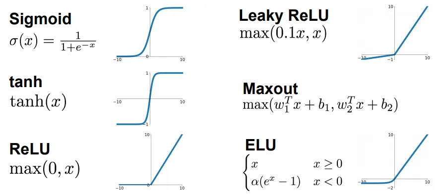

# 感知机之殇

人工神经网络发展的另一位关键人物是美国神经科学家弗兰克·罗森布拉特（Frank Rosenblatt）。

1957年，弗兰克·罗森布拉特受 Warren McCulloch 和 Walter Pitts 早期工作的启发，在 IBM 计算机上模拟实现了一种神经网络模型，并将其命名为“感知器”（Perceptron）。该模型由两层神经元构成，是首次将 McCulloch-Pitts 神经元（M-P 模型）应用于机器学习中的分类任务。

感知器的原理如下图所示，通过组合多个 M-P 神经元，对多维输入数据进行二分类，并能利用梯度下降法从训练数据中自动调整权重。

:::center
   
  图 感知机模型
:::

两年之后，罗森布拉特制造了世界第一台硬件感知机”Mark-1”。Mark I 是一种硬件实现的三层神经网络：
- 输入层由 400 个光敏元件组成，模拟视网膜；
- 隐藏层由 512 台步进电动机构成，模拟神经元的兴奋与抑制；
- 输出层连接 8 个执行器单元用于分类。

Mark I 层间连接可调权重，权重通过调整电压实现，由电动机控制电压计自动调节。当预测错误时，系统会自动迭代修改连接权重，直至准确识别输入图像。因此，这台机器被认为具有某种初步的自我学习能力。

罗森布拉特的研究得到了美国海军的资助。在项目初见成效后，他召开了一场关于感知机的新闻发布会，引发了广泛关注。《纽约时报》以“电子大脑教导它自己”为标题报道，称：“海军公布了一种新型计算机原型，希望它未来能够行走、说话、写作、视觉识别，甚至自我复制并产生自我意识。”《纽约客》更是宣称这是一台“能够思考的杰出机器”。在媒体的热潮和外界的追捧中，罗森布拉特对感知机的信心达到了顶峰。面对记者提出“是否有感知机无法完成的事”这一问题时，他答道：“爱、希望、绝望。”
:::tip

11
:::

1962 年，罗森布拉特出版《神经动力学原理 ：感知机和脑机制理
论》，系统阐述了感知机模型的理论基础与神经机制模拟方法。这本书在当时被视为神经网络研究的奠基之作，一度被誉为“神经网络派的圣经”。众多实验室开始尝试将感知机应用于文字识别、语音识别、声纳信号处理及学习记忆等多个方向，神经网络研究达到第一次高潮。

随着感知机声名鹊起，罗森布拉特的个人知名度也随之迅速攀升，他在公众视野里开跑车、登电视节目、展露钢琴才华，以张扬鲜明的个性频繁亮相。这种介于科学家与明星之间的高调姿态，让他在学界颇为异类，树敌不少，其中最知名的对手，便是他的高中同学、符号主义学派的领军人物、人工智能奠基人之一——马文·明斯基（Marvin Minsky）。

实际上，明斯基早期并不反对神经网络。1954 年，他在普林斯顿大学获得数学博士学位，其毕业论文为 *《Theory of Neural-Analog Reinforcement Systems and Its Application to the Brain-Model Problem》* “神经模拟强化系统理论及其在大脑建模问题中的应用”，从标题就可看出，这是一项关于神经网络学习机制的研究。但在 1956 年达特茅斯会议后，他的研究方向逐渐转向纽厄尔（Newell）和司马贺（Simon）等人提出的“符号主义”（Symbolic AI），即通过符号操作和逻辑推理模拟人类智能。

罗森布拉特对他的感知器寄予厚望，对人工智能神经网络的研究持十分乐观的态度，认为突破即将到来；明斯基则毫不买账，指出它的实际价值非常有限，绝不可能作为解决人工智能的问题的主要研究方法。学术观点分歧本属常态，但两人频繁在会议上争锋相对。终于，在一次会议上，争论彻底失控，两人大吵一场，矛盾彻底公开。想必那几次争论是非常激烈的，据他们的同事和学生在后来的回忆中，有“在一旁看得目瞪口呆”、“被他们的争论吓了一跳”之类的话语。

表面上，明斯基与罗森布拉特的“恩怨”是学术观点的分歧，实则夹杂着现实中的资源竞争与研究主导权之争，尤其体现在经费申请和机构话语权上。彼时，明斯基负责的 MIT 人工智能实验室向美国国防部和海军申请预算，但项目推进并不顺利。与此同时，罗森布拉特凭借感知机的一夜走红，不仅受到媒体追捧，还获得了海军的大额资助。让明斯基难以接受的是，自己十年前曾为海军效力，而海军却将经费投入给他的学弟，支持那些他六年前早已做过的课题，是可忍孰不可忍啊！

学术上的争论从来不靠口舌取胜，明斯基选择自己最擅长的数学进行回击。他与麻省理工学院的西摩·佩珀特（Seymour Papert）合作，从理论层面，对感知机进行了系统性批判，于1969年出版了具有深远影响的著作 *《感知机：计算几何学导论》（Perceptrons: An Introduction to Computational Geometry, MIT Press, 1969）* 。

书中指出，单层感知机在处理如异或（XOR）这类非线性可分问题时存在根本性限制；同时，内容还论证了多层感知机虽然在理论上更强大，但因缺乏有效的训练算法（当时反向传播尚未提出），在实践中难以实现，结构复杂度的增加也导致参数激增，训练困难。

感知机的决策函数为：

它的本质是找一个线性边界来把正类和负类分开。

异或（XOR）是一种数学运算，如果 x₁、x₂ 两个值不相同，则异或结果为 1。如果 x₁、x₂ 两个值相同，异或结果为 0。

| x₁ | x₂ | XOR(x₁, x₂) |
| -- | -- | ----------- |
| 0  | 0  | 0           |
| 0  | 1  | 1           |
| 1  | 0  | 1           |
| 1  | 1  | 0           |

将这些点画在二维平面中，将构成一个对角线交叉的“X”形分布。从上图来看，无论如何也无法用一条直线将类别 1 和类别 0 完全分开，也就是说，这些点线性不可分。

现代的电子计算机别看功能很多，从根上讲，都是由电子元件实现的与、或、非实现的逻辑运算。只要有另一个系统，哪怕看起来完全不一样，只要它也能把这些逻辑运算给撑起来，那它在计算能力上就和计算机相当，跟图灵机一个级别。反过来说，如果连这些基本逻辑都搞不定，那就比不上图灵机。现在，人们普遍认为，人脑的可计算能力远在图灵机之上，而更别提去模拟人脑了。

在《感知机》这本书对罗森布拉特工作的强烈抨击下，本质上终结了感知机的命运。次年，闵斯基获得图灵奖，得到了计算机领域的最高荣誉。

:::center
   
  图 激活函数
:::

闵斯基是当时业界的权威人物，这种对感知机直截了当的负面评价，对本性孤傲的罗森布拉特来说是致命的。一年多后，罗森布拉特在独自划船庆祝自己43岁生日那天溺水身亡。

《感知机》一书不仅打击了罗森布拉特，造成感知机的暂时失败，还几乎扼杀了当时神经网络方面的研究。部分学术圈将神经网络研究者边缘化，视之为“神棍”或者骗子，从此再也得不到美国政府和产业界的任何经费资助。神经网络由此陷入长达十余年的低谷期，后世称之为“第一次 AI 寒冬”（1970 至 1980 年代）。

[^1]: 学弟