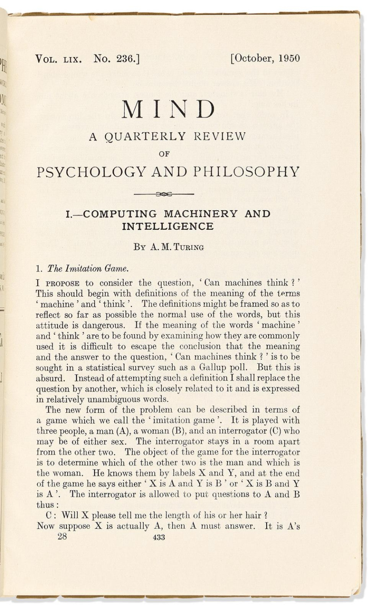
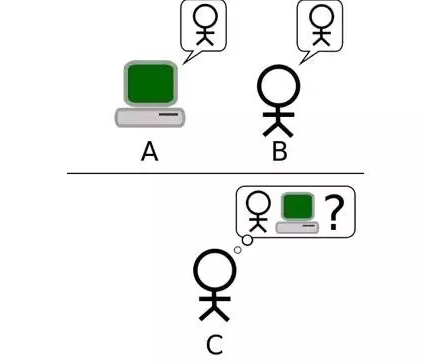

# 模仿游戏

1950 年，图灵在哲学期刊《心》（Mind）上发表一篇划时代的论文《计算机器与智能》，文中提出了著名的“模仿游戏”（imitation game），即后来广为人知的“图灵测试”。这篇文章被广泛认为是机器智能最早的系统化、科学化论述。可以说，也正是这篇论文对图灵研究工作的总结，使得图灵被后人冠以人工智能之父的荣耀。

:::center
   
  图 图灵发表在《心》杂志上的论文
:::

文章的开头，图灵抛出了一个后来被反复引用的问题：

:::tip <a/>
机器能思考么？ 

Can machines think？
:::

但他很快指出，照这个问题的原始表述继续讨论下去，其实是走不通的。图灵认为，”机器“和”思考“这两个词在自然语言中缺乏清晰的边界，不同的人会根据各自的直觉、信仰或者哲学立场给出截然不同的理解。如果围绕词义本身展开讨论，讨论将陷入无休止的概念纠缠，无法产生任何可检验、可推进的结论。

就像当年图灵用图灵机定义“可计算性”一样，他用一个可操作、可检验的过程，来取代关于“思考”的语义争论。这就是著名的“模仿游戏”，也称为图灵测试。模仿游戏的形式如图所示：一名审问者（图中的 C）通过文字与两位“看不见的对话对象”交流，其中一位是真人（B），另一位是机器（A）。在图灵看来，如果在持续交流中，审问者始终分不清谁是人、谁是机器，那么这台机器就可以被认为在相关意义上表现出了“思考”的能力。

:::center
   
  图 图灵测试一个标准的模式：C 使用问题来判断 A 或 B 是人类还是机械
:::

但接下来的发展，恐怕连图灵本人都没有预料到：图灵测试逐渐成了衡量人工智能水平的重要标尺。也许是因为图灵本身传奇般的声名，也许是因为测试形式简洁直观，或者人工智能领域本身就需要一个指向标，再加上媒体和文艺作品的不断渲染。结果是，诞生 70 多年前的思想实验，到今天还在影响着人工智能的发展，一代又一代研究者乐此不疲地尝尽各种方法，试图通过图灵测试。

有趣的是，因为机器在图灵测试上一次又一次的失败，人类基于机器通过这种测试的困难度，反而创造出图灵测试最广泛的应用场景，即在网络上随处可见的**验证码**。为了防止网站被自动化系统滥用，在网站上执行一些操作前，用户被给予一个扭曲的图形，并要求输入图中的字母或数字。其背后的原因是，当时并不存在能够稳定识别并还原这些扭曲图形的自动化系统，能够做到这一点的就可以被认为是人类。

:::center
   
  图 12306 网站的验证界面
:::

验证码的英文全称是 Completely Automated Public Turing test to tell Computers and Humans Apart，简称 CAPTCHA，翻译过来是“全自动区分计算机和人类的图灵测试”。也就是说，当你输入验证码时，实际上在参加一场“图灵测试”。只不过这一次，是由计算机来考人类，因此 CAPTCHA 有时也被称作“反向图灵测试”。

