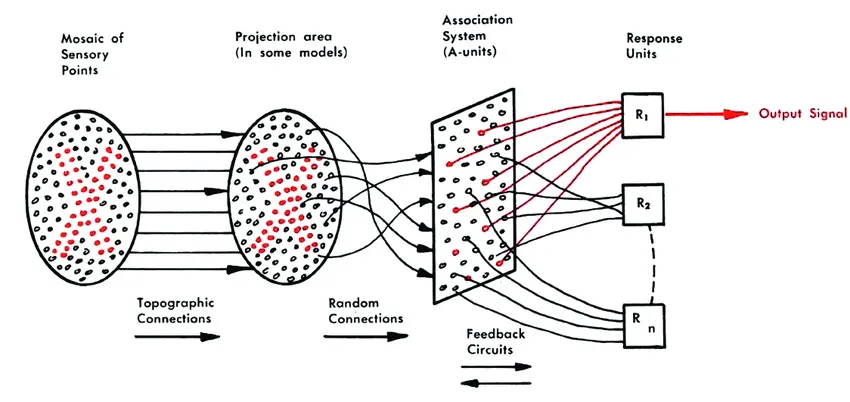
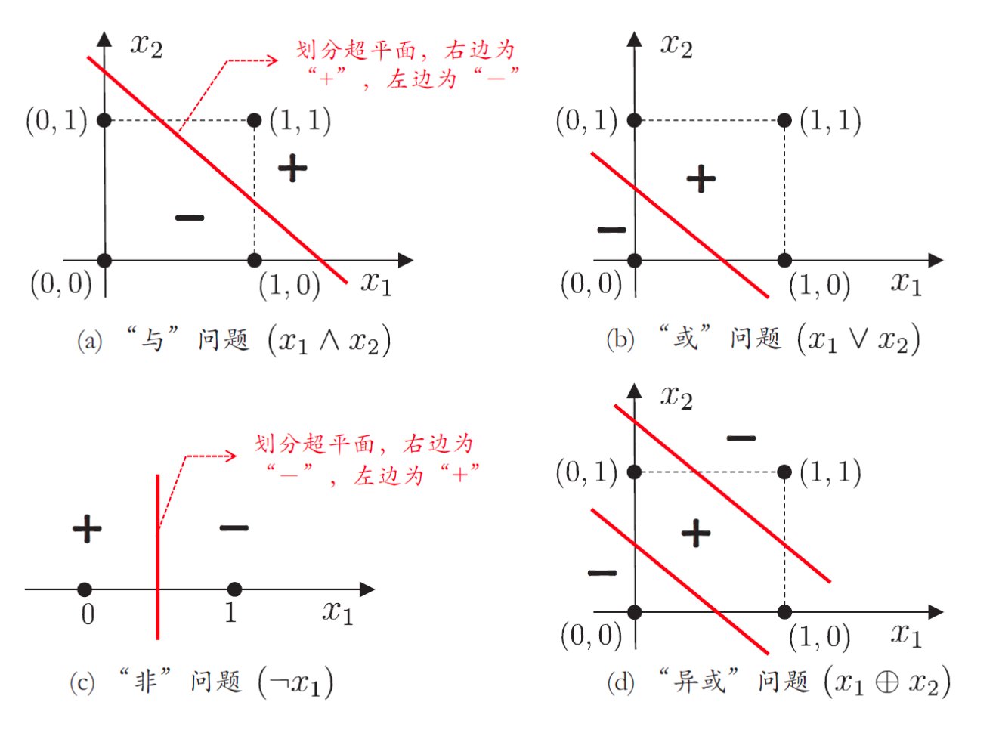

# 感知机

人工神经网络发展的另一位关键人物是美国神经科学家弗兰克·罗森布拉特（Frank Rosenblatt）。

1957年，弗兰克·罗森布拉特受 Warren McCulloch 和 Walter Pitts 早期工作的启发，在 IBM 计算机上模拟实现了一种神经网络模型，并将其命名为“感知器”（Perceptron）。该模型由两层神经元构成，是首次将 McCulloch-Pitts 神经元（M-P 模型）应用于机器学习中的分类任务。感知器通过组合多个 M-P 神经元，对多维输入数据进行二分类，并能利用梯度下降法从训练数据中自动调整权重。

:::center
   
  图 感知机模型
:::

两年之后，罗森布拉特制造了世界第一台硬件感知机”Mark-1”。Mark I 是一种硬件实现的三层神经网络：
- 输入层由 400 个光敏元件组成，模拟视网膜；
- 隐藏层由 512 台步进电动机构成，模拟神经元的兴奋与抑制；
- 输出层连接 8 个执行器单元用于分类。

Mark I 层间连接可调权重，权重通过调整电压实现，由电动机控制电压计自动调节。当预测错误时，系统会自动迭代修改连接权重，直至准确识别输入图像。因此，这台机器被认为具有某种初步的自我学习能力。

罗森布拉特的研究得到了美国海军的资助。在项目初见成效后，他召开了一场关于感知机的新闻发布会，引发了广泛关注。《纽约时报》以“电子大脑教导它自己”为标题报道，称：“海军公布了一种新型计算机原型，希望它未来能够行走、说话、写作、视觉识别，甚至自我复制并产生自我意识。”《纽约客》更是宣称这是一台“能够思考的杰出机器”。在媒体的热潮和外界的追捧中，罗森布拉特对感知机的信心达到了顶峰。面对记者提出“是否有感知机无法完成的事”这一问题时，他答道：“爱、希望、绝望。”
:::tip

11
:::

1962 年，罗森布拉特出版《神经动力学原理：感知机和脑机制理论》，系统阐述了感知机模型的理论基础，以及利用神经网络模拟大脑机制的方法。这本书成为早期神经网络研究的重要著作，被许多研究者视为连接主义路线的代表性成果。

随着感知机声名鹊起，罗森布拉特也迅速成为人工智能领域的公众人物。他驾驶跑车、参加电视节目，并展示自己的音乐才华，以一种不同于传统科学家的鲜明形象频繁出现在公众视野中。这种介于科学家与公众人物之间的姿态，使他备受关注，也引来了不少争议。而在众多批评者中，最著名的便是他的高中同学、符号主义人工智能代表人物之一——马文·明斯基（Marvin Minsky）。

有趣的是，明斯基早期并不是神经网络的反对者。1954 年，他在普林斯顿大学获得数学博士学位，其博士论文《Theory of Neural-Analog Reinforcement Systems and Its Application to the Brain-Model Problem》研究的正是神经网络学习机制问题。然而，随着研究深入，明斯基逐渐认为，简单模拟神经元连接并不足以解释人类智能中的推理、知识和抽象能力。1956 年达特茅斯会议之后，以纽厄尔（Newell）、司马贺（Simon）等人为代表的符号主义路线兴起，明斯基也逐渐成为这一学派的重要推动者。

两人的分歧，本质上在于如何看待这种由生物启发而来的计算方法。罗森布拉特对感知器寄予厚望，相信神经网络很快能够取得突破；而明斯基则认为感知器能力有限，不可能成为解决人工智能问题的主要途径。学术争论本属正常，但两人在多次会议上的交锋逐渐升级，最终在一次会议中爆发激烈争吵，双方分歧公开化。后来，他们的同事和学生回忆起当时的场景，仍形容“在一旁看得目瞪口呆”“被他们的争论吓了一跳”，可见两人的冲突之激烈。

表面上看，明斯基与罗森布拉特的冲突源于对人工智能发展路线的不同判断，但背后也夹杂着现实中的资源竞争与研究主导权之争，尤其体现在科研经费和机构影响力的角逐上。彼时，明斯基领导的麻省理工学院人工智能实验室同样在争取美国国防部和海军的支持，但项目推进并不顺利。与此同时，罗森布拉特的感知机因媒体宣传迅速走红，不仅成为公众关注的焦点，也获得了海军的大规模资助。

对明斯基而言，这种反差无疑更加刺眼。曾经与海军有合作经历的他，看着大量资源投入到自己认为存在根本缺陷的感知机研究中，而这一领域又被外界寄予了过高期待，这进一步加剧了双方之间的矛盾。1969 年，明斯基与麻省理工学院的西摩·佩珀特（Seymour Papert）合作，从理论层面，对感知机进行了系统性批判，于出版了具有深远影响的著作 *《感知机：计算几何学导论》（Perceptrons: An Introduction to Computational Geometry, MIT Press, 1969）* 。

书中指出，单层感知机在处理如异或（XOR）这类非线性可分问题时存在根本性限制；同时，内容还论证了多层感知机虽然在理论上更强大，但因缺乏有效的训练算法（当时反向传播尚未提出），在实践中难以实现，结构复杂度的增加也导致参数激增，训练困难。

感知机的决策函数为：

它的本质是找一个线性边界来把正类和负类分开。

异或（XOR）是一种数学运算，如果 x₁、x₂ 两个值不相同，则异或结果为 1。如果 x₁、x₂ 两个值相同，异或结果为 0。

| x₁ | x₂ | XOR(x₁, x₂) |
| -- | -- | ----------- |
| 0  | 0  | 0           |
| 0  | 1  | 1           |
| 1  | 0  | 1           |
| 1  | 1  | 0           |

将这些点画在二维平面中，将构成一个对角线交叉的“X”形分布。从图来看，无论如何也无法用一条直线将类别 1 和类别 0 完全分开，也就是说，这些点线性不可分。

:::center
   
  图 线性可分的“与”、“或”、“非”问题与非线性可分的“异或”问题
:::

现代的电子计算机别看功能很多，从根上讲，都是由电子元件实现的与、或、非实现的逻辑运算。只要有另一个系统，哪怕看起来完全不一样，只要它也能把这些逻辑运算给撑起来，那它在计算能力上就和计算机相当，跟图灵机一个级别。反过来说，如果连这些基本逻辑都搞不定，那就比不上图灵机，更别提去模拟人脑了。

在《感知机》这本书对罗森布拉特工作的强烈抨击下，本质上终结了感知机的命运。次年，闵斯基获得图灵奖，得到了计算机领域的最高荣誉。

明斯基和帕佩特的《感知器》最为人熟知的一面，是它对早期神经网络研究造成了巨大冲击。书中对单层感知机局限性的系统分析，使许多人开始怀疑神经网络路线的前景，并间接促成了第一次人工智能寒冬。

然而，从更长远的角度看，这本书还有另一层重要意义：它首次尝试从几何角度分析机器学习问题。事实上，这一点也体现在它的副标题——“计算几何学导论”中。当时，一位为罗森布拉特辩护的评论者曾提出疑问：

:::tip 
“计算几何”这一新兴领域，究竟会成长为一个活跃的数学方向，还是会逐渐陷入无数无法突破的死胡同？
:::

历史给出了答案。计算几何最终发展成为计算机科学中的重要分支，并广泛应用于图形学、机器人、计算机视觉等领域。

更值得注意的是，明斯基和帕佩特还首次将群论思想引入机器学习分析。他们意识到，现实世界中的对象往往具有某些不随变化而改变的性质，例如图像经过平移、旋转后，其类别信息仍然保持不变。这种“不变性”的思想，后来成为卷积神经网络、图神经网络以及几何深度学习的重要理论基础。

闵斯基是当时业界的权威人物，这种对感知机直截了当的负面评价，对本性孤傲的罗森布拉特来说是致命的。一年多后，罗森布拉特在独自划船庆祝自己43岁生日那天溺水身亡。

《感知机》一书不仅打击了罗森布拉特，造成感知机的暂时失败，还几乎扼杀了当时神经网络方面的研究。部分学术圈将神经网络研究者边缘化，视之为“神棍”或者骗子。神经网络由此陷入长达十余年的低谷期，后世称之为“第一次 AI 寒冬”（1970 至 1980 年代）。

[^1]: 学弟